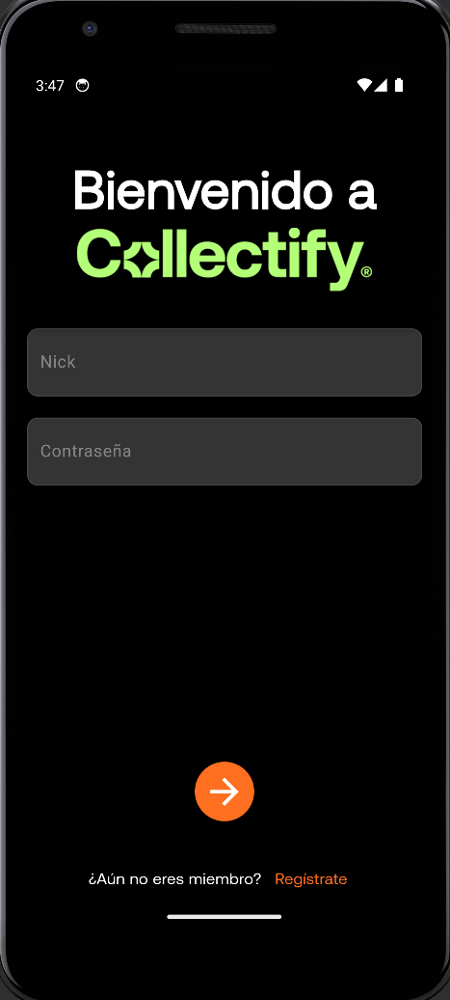

 
<p align="center">
  
</p>


**Collectify** is a marketplace application designed for buying and selling art objects or similar items. This project was developed as part of the "Software Engineering Projects" course during my Erasmus exchange at the Polytechnic University of Valencia. The app allows users to either purchase items directly or place bids in auctions, providing a flexible platform for collectors and sellers alike.

## Project Background

This project was a collaborative effort involving a diverse team of six students, consisting of four Spaniards and two Italians. It was an invaluable experience for me, not only in terms of technical growth but also in improving my language skills and understanding of cross-cultural teamwork.

## Key Features

- **Marketplace for Art Objects**: Users can explore a wide range of art items and collectibles.
- **Direct Purchase**: Items can be bought directly at a listed price.
- **Auction System**: Users have the option to bid on items, creating a competitive environment.
- **Sustainability Focus**: The app was developed with the aim of aligning with the goals of the 2030 Agenda, emphasizing sustainable development and responsible consumption.

## Technologies Used

- **Dart**: The primary programming language used for the app's development.
- **C++**: Utilized for performance-critical components and backend services.
- **Flutter**: The app's frontend was built using Flutter, leveraging Dart's strengths for cross-platform development.
  
### Login Page

Here is a screenshot of the login page:



## Demonstration Video
Check out the demonstration video of the Collectify application:

[Watch the video](https://youtube.com/shorts/CgKHJart9wI)

## Getting Started

To get started with Collectify, clone the repository and try to compile and install the app in your Android Studio environment.

```bash
git clone https://github.com/grecomatteo/CollectifyApp.git
